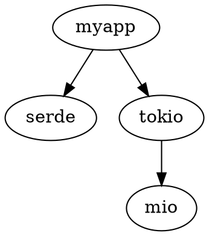

# Project D08: Static Vulnerability Scanner

> โมดูล: D — Security & Cryptography | ความยาก: ⭐⭐⭐⭐⭐ | เวลาโดยประมาณ: 10 ชั่วโมง

## ภาพรวมโปรเจค

Static Vulnerability Scanner เป็นเครื่องมือวิเคราะห์ความปลอดภัยของโปรเจค Rust แบบ static analysis ที่ทำงานโดยไม่ต้องรันโปรแกรม ตัวสแกนนี้ตรวจสอบสองมิติหลัก:

1. **Dependency vulnerabilities** — เปรียบเทียบ dependency ใน `Cargo.lock` กับฐานข้อมูล advisory จาก RustSec เพื่อหา crate ที่มี CVE หรือ security advisory ที่ยังไม่ได้แพตช์
2. **Source code patterns** — ตรวจสอบ source code `.rs` เพื่อหา pattern ที่เป็น indicator ของ code quality และ security concern เช่น `unsafe` blocks, `unwrap()`, และ hardcoded credential strings

ใน production โปรเจคนี้ตอบ use case:
- CI/CD pipeline ที่ต้องการ gate ไม่ให้ deploy เมื่อ dependency มี CRITICAL advisory ที่ยังไม่ได้ update
- IDE integration ผ่าน SARIF 2.1.0 format (รองรับ VS Code, GitHub Code Scanning, Azure DevOps Pipelines)
- Pre-release security audit ก่อน publish crate ขึ้น crates.io
- Compliance reporting — สร้าง HTML report สำหรับทีม security ที่ต้องการ audit trail

**Learning value:** โปรเจคนี้สอน multi-format report generation (SARIF/HTML/JSON), TOML parsing สำหรับ lock file และ advisory database, semver range matching, filesystem traversal ด้วย `walkdir`, และ incremental file processing ด้วย `git2` crate

## สิ่งที่จะได้เรียนรู้

- **TOML parsing แบบ dynamic** — ใช้ `toml::Value` แทน derived struct เพื่อ handle schema ที่ evolve ได้จาก RustSec spec
- **Semver range matching** — ใช้ `semver` crate ตรวจ `VersionReq` กับ `Version` รวมถึง edge cases ของ pre-release versions
- **Regex pattern matching** — ตรวจหา dangerous patterns ใน source code รวมถึง case-insensitive secret detection
- **Filesystem traversal** — ใช้ `walkdir` เดิน directory tree กรองไฟล์ `.rs` โดยไม่ตาม symlink
- **SARIF 2.1.0 output** — สร้าง SARIF JSON ที่ถูกต้องตาม OASIS spec สำหรับ IDE/CI integration
- **Self-contained HTML report** — generate HTML ที่มี inline CSS และ JavaScript sortable table
- **Exit code strategy สำหรับ CI** — exit 0/1/2 convention ที่ CI tools คาดหวัง
- **Incremental scan ด้วย git2** — ดึง changed files ระหว่าง two commits เพื่อ skip unchanged files

## ความรู้ที่ต้องมีมาก่อน

- **Part 10–20** — Struct, enum, trait, impl blocks, ownership และ borrowing พื้นฐาน
- **Part 30–35** — Error handling ด้วย `Result`, `?` operator, custom error types
- **Part 36–40** — Iterators, `map`, `filter`, `collect`, method chaining
- **Part 80–85** — serde/serde_json, `Serialize`/`Deserialize` derive macros
- **Part 86–90** — ใช้งาน third-party crates รวมถึง `regex`, `semver`, `walkdir`
- **Part 91–95** — clap 4 CLI design, derive macro, `Args` struct, `ValueEnum`

## โครงสร้างโปรเจค (Project Layout)

```
vuln-scanner/
├── src/
│   ├── main.rs              # CLI entry point (clap 4) + exit code strategy
│   ├── lib.rs               # Core types + public API re-exports
│   ├── cargo_lock.rs        # Cargo.lock TOML parser → Vec<Dependency>
│   ├── advisory.rs          # RustSec advisory TOML parser → Advisory
│   ├── version_match.rs     # Semver range matching → Vec<VulnMatch>
│   ├── scanner.rs           # walkdir filesystem walker + regex pattern rules
│   ├── audit.rs             # Dependency audit rules: duplicates, depth, ignore list
│   ├── sarif.rs             # SARIF 2.1.0 JSON output builder
│   ├── html_report.rs       # Self-contained HTML report generator
│   ├── config.rs            # .vuln-scanner.toml configuration loader
│   └── git_diff.rs          # git2 incremental scan — changed files since commit
├── advisories/
│   └── RUSTSEC-2021-0001.toml   # Bundled sample advisory สำหรับ tests
├── tests/
│   └── integration_test.rs
├── .vuln-scanner.toml       # Example project configuration
└── Cargo.toml
```

## การออกแบบ (Architecture & Design)

### Data Flow

```
Cargo.lock ──► cargo_lock::parse()  ──►  Vec<Dependency>
                                                │
advisories/ ──► advisory::load_all() ──►  Vec<Advisory>
                                                │
                                      version_match::check_all()
                                                │
                                        Vec<VulnMatch>
                                                │
src/**/*.rs ──► scanner::walk_and_scan() ──►  Vec<Finding>
                                                │
                                         audit::check_*()
                                                │
                              ┌─────────────────┼──────────────────┐
                           SARIF              HTML               JSON
                       (IDE/CI tools)      (audit report)     (stdout/CI)
                      sarif::build()    html_report::generate()
```

### Design Decisions

**ทำไมไม่ใช้ network request ดึง advisory จาก rustsec.org โดยตรง?**

Advisory database ใช้ bundled TOML files แทน live network call เพราะ:
1. CI environment บางแห่งไม่มี outbound internet access
2. Network latency ทำให้ scan ช้าลงโดยไม่จำเป็น
3. Reproducibility — advisory ที่ใช้ scan จะเหมือนกันทุกครั้ง ควบคุมได้ด้วย version control

ใน production deployment จะเพิ่ม step `git pull` advisory database repository ก่อน scan แล้วค่อย pass path ให้ `--advisory-db`

**ทำไมใช้ `toml::Value` แบบ dynamic แทน fully-derived struct?**

Advisory format ของ RustSec มี optional fields จำนวนมาก และ spec เปลี่ยนได้เมื่อมี advisory type ใหม่ การใช้ `toml::Value` ทำให้โค้ดทนทานต่อ schema change โดยไม่ต้องแก้ struct definition ทุกครั้ง แต่ใช้ strong types สำหรับ fields ที่จำเป็น

**ทำไม exit code 2 สำหรับ error ไม่ใช่ exit code 1?**

Convention ของ Unix tools ที่ใช้ใน CI:
- `0` — success (ไม่พบ vulnerability ที่เกิน threshold)
- `1` — found issues (พบ vulnerability ที่เกิน threshold ที่กำหนด)
- `2` — tool error (parse error, missing file, etc.)

CI tools เช่น GitHub Actions, Jenkins ตรวจ exit code เพื่อแยกระหว่าง "scan passed", "scan found issues", และ "scan failed to run"

### Module Boundaries

| Module | Input | Output | Side Effects |
|--------|-------|--------|--------------|
| `cargo_lock` | `&str` (TOML content) | `Vec<Dependency>` | ไม่มี |
| `advisory` | `&Path` (directory) | `Vec<Advisory>` | อ่านไฟล์ |
| `version_match` | deps + advisories | `Vec<VulnMatch>` | ไม่มี |
| `scanner` | `&Path` (root dir) | `Vec<Finding>` | อ่านไฟล์ |
| `audit` | `Vec<Dependency>` | `Vec<AuditIssue>` | ไม่มี |
| `sarif` | findings + matches | SARIF JSON string | ไม่มี |
| `html_report` | findings + matches | HTML string | ไม่มี |
| `git_diff` | commit hash | `HashSet<PathBuf>` | อ่าน `.git` directory |

---

## การพัฒนาทีละขั้นตอน

### ขั้นที่ 1: โครงสร้างโปรเจค, Cargo.toml และ Core Types

เริ่มจากการกำหนด `Cargo.toml` ที่รวม crate ทั้งหมดที่โปรเจคต้องใช้ และกำหนด type definitions หลักที่ทุก module ใช้ร่วมกัน

**Cargo.toml**

```toml
[package]
name = "vuln-scanner"
version = "0.1.0"
edition = "2021"
description = "Static vulnerability scanner for Rust projects"

[[bin]]
name = "vuln-scanner"
path = "src/main.rs"

[dependencies]
toml       = "0.8"
semver     = "1"
serde      = { version = "1", features = ["derive"] }
serde_json = "1"
regex      = "1"
walkdir    = "2"
clap       = { version = "4", features = ["derive"] }
chrono     = { version = "0.4", features = ["serde"] }
git2       = "0.19"

[dev-dependencies]
tempfile = "3"
```

**src/lib.rs** — type definitions กลาง

Core types ทั้งหมดอยู่ใน `lib.rs` เพื่อให้ทุก module import จากที่เดียว:

```rust
// src/lib.rs
pub mod advisory;
pub mod audit;
pub mod cargo_lock;
pub mod config;
pub mod git_diff;
pub mod html_report;
pub mod sarif;
pub mod scanner;
pub mod version_match;

/// Dependency ที่ถูก parse มาจาก Cargo.lock [[package]] entry
#[derive(Debug, Clone, PartialEq, Eq, Hash)]
pub struct Dependency {
    pub name: String,
    pub version: String,
    /// Source URL เช่น "registry+https://github.com/rust-lang/crates.io-index"
    /// None หมายความว่าเป็น local workspace member
    pub source: Option<String>,
    /// Transitive depth ใน dependency graph
    /// 0 = direct dependency ใน [dependencies], 1 = dep ของ dep, ฯลฯ
    /// ค่า default 0 — populate ใน audit module
    pub depth: usize,
}

/// Advisory จาก RustSec database (1 ไฟล์ TOML = 1 Advisory)
#[derive(Debug, Clone)]
pub struct Advisory {
    /// เช่น "RUSTSEC-2021-0001"
    pub id: String,
    /// ชื่อ crate ที่ได้รับผลกระทบ
    pub package: String,
    /// VersionReq strings สำหรับ versions ที่แก้ไขแล้ว เช่น [">= 1.2.3"]
    pub patched_versions: Vec<String>,
    /// VersionReq strings สำหรับ versions ที่ไม่ได้รับผลกระทบ เช่น ["< 1.0.0"]
    pub unaffected_versions: Vec<String>,
    /// คำอธิบายช่องโหว่ทางเทคนิค
    pub description: String,
    /// CVSS v3 vector string เช่น "CVSS:3.1/AV:N/AC:L/..."
    pub cvss: Option<String>,
    /// CVE IDs หรือ GHSA IDs ที่เกี่ยวข้อง
    pub aliases: Vec<String>,
}

/// ระดับความรุนแรงของ vulnerability
/// derive Ord เพื่อ compare ด้วย >= ใน CI exit code check
#[derive(Debug, Clone, PartialEq, Eq, PartialOrd, Ord)]
pub enum Severity {
    Unknown,
    Low,
    Medium,
    High,
    Critical,
}

impl Severity {
    /// แปลงจาก CVSS vector string เป็น Severity
    /// ดู: https://www.first.org/cvss/specification-document
    pub fn from_cvss_vector(cvss: Option<&str>) -> Self {
        match cvss {
            Some(v) if v.contains("C:H") && v.contains("I:H") => Severity::Critical,
            Some(v) if v.contains("C:H") || v.contains("I:H") => Severity::High,
            Some(v) if v.contains("C:L") || v.contains("I:L") => Severity::Medium,
            Some(_) => Severity::Low,
            None => Severity::Unknown,
        }
    }

    pub fn as_str(&self) -> &'static str {
        match self {
            Severity::Critical => "CRITICAL",
            Severity::High => "HIGH",
            Severity::Medium => "MEDIUM",
            Severity::Low => "LOW",
            Severity::Unknown => "UNKNOWN",
        }
    }
}

/// ผลการตรวจพบ: dependency นี้ตรงกับ advisory นี้
#[derive(Debug, Clone)]
pub struct VulnMatch {
    pub dep: Dependency,
    pub advisory: Advisory,
    pub severity: Severity,
}

/// ผลการตรวจพบจาก source code scan (unsafe, unwrap, hardcoded secret, etc.)
#[derive(Debug, Clone)]
pub struct Finding {
    /// Rule ID เช่น "SC001", "SC003"
    pub rule_id: String,
    /// Relative path ของไฟล์
    pub file_path: String,
    /// Line number (1-indexed), 0 หมายถึง file-level finding
    pub line: u32,
    /// Code snippet ที่ตรวจพบ (ไม่ใช่ full line)
    pub snippet: String,
    /// คำอธิบายทางเทคนิคของสิ่งที่ตรวจพบ
    pub message: String,
    pub severity: Severity,
}

/// ผลการตรวจสอบ dependency graph structure
#[derive(Debug, Clone)]
pub struct AuditIssue {
    pub kind: AuditIssueKind,
    pub crate_name: String,
    pub message: String,
    pub severity: Severity,
}

#[derive(Debug, Clone, PartialEq)]
pub enum AuditIssueKind {
    DuplicateVersion,
    ExcessiveDepth,
}
```

---

### ขั้นที่ 2: Cargo.lock Parser

`Cargo.lock` ใช้ TOML format โดย Cargo version 3 (Rust 1.55+) ใช้ `version = 3` พร้อม `[[package]]` array of tables

ตัวอย่าง `Cargo.lock` ย่อ:

```toml
# This file is automatically @generated by Cargo.
version = 3

[[package]]
name = "serde"
version = "1.0.197"
source = "registry+https://github.com/rust-lang/crates.io-index"
checksum = "3fb1c873e1b9b056a4dc4c0c198b24c3ffa059243875552b2bd0933b1aee4ce2"
dependencies = [
 "serde_derive",
]

[[package]]
name = "anyhow"
version = "1.0.75"
source = "registry+https://github.com/rust-lang/crates.io-index"
checksum = "a4668cab20f0df5abcef2cde8f62a7aedb1e4f07e50e5c8afb8d89dc1a5e2b50"

[[package]]
name = "myapp"
version = "0.1.0"
dependencies = [
 "serde",
 "anyhow",
]
```

**src/cargo_lock.rs**

```rust
// src/cargo_lock.rs
use crate::Dependency;
use std::path::Path;

/// Parse เนื้อหา Cargo.lock string → Vec<Dependency>
/// source จะเป็น None สำหรับ workspace members และ path dependencies
pub fn parse(content: &str) -> Result<Vec<Dependency>, String> {
    let value: toml::Value = toml::from_str(content)
        .map_err(|e| format!("Cargo.lock parse error: {e}"))?;

    let packages = match value.get("package").and_then(|v| v.as_array()) {
        Some(p) => p,
        None => return Ok(vec![]),
    };

    let mut deps = Vec::with_capacity(packages.len());

    for pkg in packages {
        let name = match pkg.get("name").and_then(|v| v.as_str()) {
            Some(n) => n.to_string(),
            None => continue,
        };
        let version = match pkg.get("version").and_then(|v| v.as_str()) {
            Some(v) => v.to_string(),
            None => continue,
        };
        let source = pkg
            .get("source")
            .and_then(|v| v.as_str())
            .map(String::from);

        deps.push(Dependency {
            name,
            version,
            source,
            depth: 0,
        });
    }

    Ok(deps)
}

/// อ่านจากไฟล์โดยตรง
pub fn load(path: &Path) -> Result<Vec<Dependency>, String> {
    let content = std::fs::read_to_string(path)
        .map_err(|e| format!("Cannot read {}: {e}", path.display()))?;
    parse(&content)
}

#[cfg(test)]
mod tests {
    use super::*;

    const SAMPLE_LOCK: &str = r#"
version = 3

[[package]]
name = "serde"
version = "1.0.197"
source = "registry+https://github.com/rust-lang/crates.io-index"
checksum = "3fb1c873e1b9b056a4dc4c0c198b24c3ffa059243875552b2bd0933b1aee4ce2"

[[package]]
name = "anyhow"
version = "1.0.75"
source = "registry+https://github.com/rust-lang/crates.io-index"
checksum = "a4668cab20f0df5abcef2cde8f62a7aedb1e4f07e50e5c8afb8d89dc1a5e2b50"

[[package]]
name = "myapp"
version = "0.1.0"
"#;

    #[test]
    fn test_parse_count() {
        let deps = parse(SAMPLE_LOCK).unwrap();
        assert_eq!(deps.len(), 3);
    }

    #[test]
    fn test_parse_serde_version() {
        let deps = parse(SAMPLE_LOCK).unwrap();
        let serde = deps.iter().find(|d| d.name == "serde").unwrap();
        assert_eq!(serde.version, "1.0.197");
    }

    #[test]
    fn test_parse_registry_source() {
        let deps = parse(SAMPLE_LOCK).unwrap();
        let serde = deps.iter().find(|d| d.name == "serde").unwrap();
        assert!(serde.source.as_ref().unwrap().contains("crates.io-index"));
    }

    #[test]
    fn test_workspace_member_no_source() {
        let deps = parse(SAMPLE_LOCK).unwrap();
        let myapp = deps.iter().find(|d| d.name == "myapp").unwrap();
        assert!(myapp.source.is_none());
    }

    #[test]
    fn test_empty_lock_file() {
        let deps = parse("version = 3\n").unwrap();
        assert!(deps.is_empty());
    }

    #[test]
    fn test_invalid_toml_returns_error() {
        let result = parse("this is not valid toml !!!");
        assert!(result.is_err());
        assert!(result.unwrap_err().contains("parse error"));
    }
}
```

---

### ขั้นที่ 3: RustSec Advisory Parser + Version Range Matching

**Format ของ RustSec advisory TOML**

```toml
# advisories/RUSTSEC-2021-0001.toml
id = "RUSTSEC-2021-0001"

[package]
name = "some-crate"
patched_versions    = [">= 1.2.3"]
unaffected_versions = ["< 1.0.0"]

[advisory]
date        = "2021-01-15"
url         = "https://github.com/example/some-crate/security/advisories/GHSA-xxxx"
title       = "Use-after-free in some_crate::Parser"
description = """
A use-after-free condition exists in the Parser::parse() method when input
contains specific multibyte sequences. The condition is reachable via
network-accessible interfaces without authentication.
"""
cvss    = "CVSS:3.1/AV:N/AC:L/PR:N/UI:N/S:U/C:H/I:H/A:H"
aliases = ["CVE-2021-12345", "GHSA-xxxx-yyyy-zzzz"]
```

**src/advisory.rs**

```rust
// src/advisory.rs
use crate::Advisory;
use std::path::Path;

/// Parse advisory จาก TOML content string
pub fn parse(content: &str) -> Result<Advisory, String> {
    let value: toml::Value = toml::from_str(content)
        .map_err(|e| format!("Advisory TOML parse error: {e}"))?;

    let id = value
        .get("id")
        .and_then(|v| v.as_str())
        .ok_or("advisory missing required 'id' field")?
        .to_string();

    let pkg = value
        .get("package")
        .ok_or("advisory missing required [package] table")?;

    let package = pkg
        .get("name")
        .and_then(|v| v.as_str())
        .ok_or("advisory [package] missing required 'name' field")?
        .to_string();

    // patched_versions: รองรับทั้ง array และ single string
    let patched_versions = match pkg.get("patched_versions") {
        Some(toml::Value::Array(arr)) => arr
            .iter()
            .filter_map(|v| v.as_str().map(String::from))
            .collect(),
        Some(toml::Value::String(s)) => vec![s.clone()],
        _ => vec![],
    };

    let unaffected_versions = match pkg.get("unaffected_versions") {
        Some(toml::Value::Array(arr)) => arr
            .iter()
            .filter_map(|v| v.as_str().map(String::from))
            .collect(),
        Some(toml::Value::String(s)) => vec![s.clone()],
        _ => vec![],
    };

    let adv_table = value.get("advisory");

    let description = adv_table
        .and_then(|v| v.get("description"))
        .and_then(|v| v.as_str())
        .unwrap_or("")
        .trim()
        .to_string();

    let cvss = adv_table
        .and_then(|v| v.get("cvss"))
        .and_then(|v| v.as_str())
        .map(String::from);

    let aliases = adv_table
        .and_then(|v| v.get("aliases"))
        .and_then(|v| v.as_array())
        .map(|arr| {
            arr.iter()
                .filter_map(|v| v.as_str().map(String::from))
                .collect::<Vec<_>>()
        })
        .unwrap_or_default();

    Ok(Advisory {
        id,
        package,
        patched_versions,
        unaffected_versions,
        description,
        cvss,
        aliases,
    })
}

/// โหลด advisory ทั้งหมดจาก directory
/// ไฟล์ที่ parse ไม่ได้จะแสดง warning และ skip
pub fn load_all(dir: &Path) -> Result<Vec<Advisory>, String> {
    if !dir.exists() {
        return Ok(vec![]);
    }

    let mut advisories = Vec::new();

    for entry in std::fs::read_dir(dir)
        .map_err(|e| format!("Cannot read advisory dir {}: {e}", dir.display()))?
    {
        let entry = entry.map_err(|e| e.to_string())?;
        let path = entry.path();

        if path.extension().and_then(|e| e.to_str()) != Some("toml") {
            continue;
        }

        let content = std::fs::read_to_string(&path)
            .map_err(|e| format!("Cannot read {}: {e}", path.display()))?;

        match parse(&content) {
            Ok(adv) => advisories.push(adv),
            Err(e) => eprintln!("Warning: skipping {}: {e}", path.display()),
        }
    }

    Ok(advisories)
}

#[cfg(test)]
mod tests {
    use super::*;

    const ADV_TOML: &str = r#"
id = "RUSTSEC-2021-0001"

[package]
name = "some-crate"
patched_versions    = [">= 1.2.3"]
unaffected_versions = ["< 1.0.0"]

[advisory]
description = "A use-after-free condition in Parser::parse() prior to version 1.2.3."
cvss        = "CVSS:3.1/AV:N/AC:L/PR:N/UI:N/S:U/C:H/I:H/A:H"
aliases     = ["CVE-2021-12345"]
"#;

    #[test]
    fn test_parse_id() {
        let adv = parse(ADV_TOML).unwrap();
        assert_eq!(adv.id, "RUSTSEC-2021-0001");
    }

    #[test]
    fn test_parse_package_name() {
        let adv = parse(ADV_TOML).unwrap();
        assert_eq!(adv.package, "some-crate");
    }

    #[test]
    fn test_parse_patched_versions() {
        let adv = parse(ADV_TOML).unwrap();
        assert_eq!(adv.patched_versions, vec![">= 1.2.3"]);
    }

    #[test]
    fn test_parse_unaffected_versions() {
        let adv = parse(ADV_TOML).unwrap();
        assert_eq!(adv.unaffected_versions, vec!["< 1.0.0"]);
    }

    #[test]
    fn test_parse_cvss() {
        let adv = parse(ADV_TOML).unwrap();
        assert_eq!(
            adv.cvss.as_deref(),
            Some("CVSS:3.1/AV:N/AC:L/PR:N/UI:N/S:U/C:H/I:H/A:H")
        );
    }

    #[test]
    fn test_parse_aliases() {
        let adv = parse(ADV_TOML).unwrap();
        assert_eq!(adv.aliases, vec!["CVE-2021-12345"]);
    }

    #[test]
    fn test_parse_description_nonempty() {
        let adv = parse(ADV_TOML).unwrap();
        assert!(!adv.description.is_empty());
        assert!(adv.description.contains("use-after-free"));
    }

    #[test]
    fn test_missing_id_is_error() {
        let bad = "[package]\nname = \"foo\"\n";
        assert!(parse(bad).is_err());
    }

    #[test]
    fn test_missing_package_table_is_error() {
        let bad = "id = \"RUSTSEC-2021-9999\"\n";
        assert!(parse(bad).is_err());
    }

    #[test]
    fn test_single_string_patched_versions() {
        // รองรับ advisory ที่เขียน string เดียว (malformed แต่ต้องทนทาน)
        let content = "id = \"RUSTSEC-TEST\"\n\
                       [package]\nname = \"foo\"\npatched_versions = \">= 2.0.0\"\n\
                       [advisory]\ndescription = \"test\"\n";
        let adv = parse(content).unwrap();
        assert_eq!(adv.patched_versions, vec![">= 2.0.0"]);
    }
}
```

**src/version_match.rs**

```rust
// src/version_match.rs
use crate::{Advisory, Dependency, Severity, VulnMatch};

/// ตรวจว่า dep_version อยู่ใน vulnerable range หรือไม่
///
/// Logic:
/// - ถ้า patched_versions ว่าง → ทุก version vulnerable (ไม่มี patch ใดเลย)
/// - ถ้า dep version match กับ patched range ใดสักอัน → ไม่ vulnerable
/// - ถ้าไม่ match patch range ใดเลย → vulnerable
///
/// ตัวอย่าง: patched = [">= 1.2.3"]
/// - "1.0.0" → vulnerable (ไม่ satisfy >= 1.2.3)
/// - "1.2.3" → NOT vulnerable (satisfy >= 1.2.3)
/// - "2.0.0" → NOT vulnerable (satisfy >= 1.2.3)
pub fn is_vulnerable(dep_version: &str, patched_versions: &[String]) -> bool {
    let dep_ver = match semver::Version::parse(dep_version) {
        Ok(v) => v,
        Err(_) => return false, // version ที่ parse ไม่ได้ → ถือว่าไม่ทราบสถานะ
    };

    if patched_versions.is_empty() {
        return true;
    }

    for patched in patched_versions {
        if let Ok(req) = semver::VersionReq::parse(patched) {
            if req.matches(&dep_ver) {
                return false; // patched
            }
        }
    }

    true // ไม่ตรงกับ patch range ใด → vulnerable
}

/// จับคู่ dependencies กับ advisories ทั้งหมด → Vec<VulnMatch>
pub fn check_all(deps: &[Dependency], advisories: &[Advisory]) -> Vec<VulnMatch> {
    let mut matches = Vec::new();

    for dep in deps {
        for advisory in advisories {
            if advisory.package != dep.name {
                continue;
            }
            if is_vulnerable(&dep.version, &advisory.patched_versions) {
                let severity = Severity::from_cvss_vector(advisory.cvss.as_deref());
                matches.push(VulnMatch {
                    dep: dep.clone(),
                    advisory: advisory.clone(),
                    severity,
                });
            }
        }
    }

    matches
}

#[cfg(test)]
mod tests {
    use super::*;

    #[test]
    fn test_vulnerable_below_patch() {
        assert!(is_vulnerable("1.0.0", &[">= 1.2.3".to_string()]));
    }

    #[test]
    fn test_not_vulnerable_at_patch() {
        assert!(!is_vulnerable("1.2.3", &[">= 1.2.3".to_string()]));
    }

    #[test]
    fn test_not_vulnerable_above_patch() {
        assert!(!is_vulnerable("2.0.0", &[">= 1.2.3".to_string()]));
    }

    #[test]
    fn test_no_patch_always_vulnerable() {
        assert!(is_vulnerable("0.0.1", &[]));
        assert!(is_vulnerable("999.0.0", &[]));
    }

    #[test]
    fn test_prerelease_not_satisfying_patch() {
        // 1.2.3-alpha.1 < 1.2.3 ตาม semver spec → ยัง vulnerable
        assert!(is_vulnerable("1.2.3-alpha.1", &[">= 1.2.3".to_string()]));
    }

    #[test]
    fn test_multiple_patched_ranges() {
        // security backport: ทั้ง 0.8.x series และ 1.x.x series มี patch
        let patched = vec![
            ">= 0.8.5, < 0.9.0".to_string(),
            ">= 1.2.3".to_string(),
        ];
        assert!(!is_vulnerable("0.8.5", &patched));
        assert!(is_vulnerable("0.8.4", &patched));
        assert!(!is_vulnerable("1.3.0", &patched));
        assert!(is_vulnerable("1.0.0", &patched));
    }

    #[test]
    fn test_invalid_version_string() {
        // non-semver version → ถือว่าไม่ทราบ → return false
        assert!(!is_vulnerable("not-a-version", &[">= 1.0.0".to_string()]));
    }

    #[test]
    fn test_check_all_finds_match() {
        let deps = vec![crate::Dependency {
            name: "some-crate".to_string(),
            version: "1.0.0".to_string(),
            source: None,
            depth: 0,
        }];
        let advisories = vec![crate::Advisory {
            id: "RUSTSEC-2021-0001".to_string(),
            package: "some-crate".to_string(),
            patched_versions: vec![">= 1.2.3".to_string()],
            unaffected_versions: vec![],
            description: "test".to_string(),
            cvss: Some("CVSS:3.1/AV:N/AC:L/PR:N/UI:N/S:U/C:H/I:H/A:H".to_string()),
            aliases: vec![],
        }];
        let matches = check_all(&deps, &advisories);
        assert_eq!(matches.len(), 1);
        assert_eq!(matches[0].dep.name, "some-crate");
        assert_eq!(matches[0].severity, crate::Severity::Critical);
    }

    #[test]
    fn test_check_all_no_match_different_package() {
        let deps = vec![crate::Dependency {
            name: "safe-crate".to_string(),
            version: "1.0.0".to_string(),
            source: None,
            depth: 0,
        }];
        let advisories = vec![crate::Advisory {
            id: "RUSTSEC-2021-0001".to_string(),
            package: "some-crate".to_string(),
            patched_versions: vec![">= 1.2.3".to_string()],
            unaffected_versions: vec![],
            description: "test".to_string(),
            cvss: None,
            aliases: vec![],
        }];
        let matches = check_all(&deps, &advisories);
        assert!(matches.is_empty());
    }
}
```

---

### ขั้นที่ 4: Source Code Pattern Scanner

Scanner เดิน directory tree ด้วย `walkdir` และตรวจสอบแต่ละไฟล์ `.rs` ด้วย `regex`

**src/scanner.rs**

```rust
// src/scanner.rs
use crate::{Finding, Severity};
use regex::Regex;
use std::collections::HashSet;
use std::path::{Path, PathBuf};
use std::sync::LazyLock;
use walkdir::WalkDir;

/// Pattern rule definition
struct Rule {
    id: &'static str,
    description: &'static str,
    severity: Severity,
    pattern: &'static str,
}

static RULES: LazyLock<Vec<(Rule, Regex)>> = LazyLock::new(|| {
    let rules = vec![
        Rule {
            id: "SC001",
            description: "unsafe block — requires manual correctness verification",
            severity: Severity::Medium,
            pattern: r"\bunsafe\s*\{",
        },
        Rule {
            id: "SC002",
            description: "unwrap() — panics when value is None or Err",
            severity: Severity::Low,
            pattern: r"\.unwrap\(\)",
        },
        Rule {
            id: "SC003",
            description: "hardcoded credential string detected",
            severity: Severity::Critical,
            // ต้องมีอักขระอย่างน้อย 3 ตัวในค่า string เพื่อหลีกเลี่ยง false positive
            pattern: r#"(?i)(api_key|password|secret|token|passwd)\s*=\s*"[^"]{3,}""#,
        },
        Rule {
            id: "SC004",
            description: "expect() — panics with message on None or Err",
            severity: Severity::Low,
            pattern: r#"\.expect\("[^"]+"\)"#,
        },
    ];

    rules
        .into_iter()
        .map(|r| {
            let re = Regex::new(r.pattern)
                .unwrap_or_else(|e| panic!("Invalid regex for {}: {e}", r.id));
            (r, re)
        })
        .collect()
});

/// Scan ไฟล์ `.rs` เดียว
/// max_unsafe: จำนวน unsafe block สูงสุดที่ยอมรับได้ต่อไฟล์
pub fn scan_file(path: &Path, max_unsafe: usize) -> Vec<Finding> {
    let content = match std::fs::read_to_string(path) {
        Ok(c) => c,
        Err(_) => return vec![],
    };

    let mut findings = Vec::new();
    let uri = path.to_string_lossy().to_string();

    let mut unsafe_count = 0usize;

    for (line_idx, line) in content.lines().enumerate() {
        // ข้าม comment lines เพื่อลด false positives
        let trimmed = line.trim_start();
        if trimmed.starts_with("//") || trimmed.starts_with("/*") {
            continue;
        }

        for (rule, re) in RULES.iter() {
            if re.is_match(line) {
                if rule.id == "SC001" {
                    unsafe_count += 1;
                }
                findings.push(Finding {
                    rule_id: rule.id.to_string(),
                    file_path: uri.clone(),
                    line: (line_idx + 1) as u32,
                    snippet: line.trim().to_string(),
                    message: rule.description.to_string(),
                    severity: rule.severity.clone(),
                });
            }
        }
    }

    // File-level check: unsafe count เกิน limit
    if unsafe_count > max_unsafe {
        findings.push(Finding {
            rule_id: "SC005".to_string(),
            file_path: uri,
            line: 0,
            snippet: String::new(),
            message: format!(
                "{unsafe_count} unsafe blocks in file exceeds allowed limit of {max_unsafe}"
            ),
            severity: Severity::High,
        });
    }

    findings
}

/// Walk directory tree และ scan ไฟล์ `.rs` ทั้งหมด
/// changed_only: ถ้ามีค่า จะ scan เฉพาะไฟล์ที่อยู่ใน set
pub fn walk_and_scan(
    root: &Path,
    max_unsafe: usize,
    changed_only: Option<&HashSet<PathBuf>>,
) -> Vec<Finding> {
    let mut all_findings = Vec::new();

    for entry in WalkDir::new(root)
        .follow_links(false)
        .into_iter()
        .filter_map(|e| e.ok())
    {
        let path = entry.path();

        if path.extension().and_then(|e| e.to_str()) != Some("rs") {
            continue;
        }

        // ข้าม target/ directory
        if path.components().any(|c| c.as_os_str() == "target") {
            continue;
        }

        if let Some(set) = changed_only {
            if !set.contains(path) {
                continue;
            }
        }

        all_findings.extend(scan_file(path, max_unsafe));
    }

    all_findings
}

#[cfg(test)]
mod tests {
    use super::*;
    use std::io::Write;

    fn scan_code(code: &str) -> Vec<Finding> {
        let mut f = tempfile::NamedTempFile::new().unwrap();
        write!(f, "{code}").unwrap();
        scan_file(f.path(), 99)
    }

    #[test]
    fn test_detect_unsafe_block() {
        let code = "fn foo() {\n    unsafe { *ptr = 1; }\n}\n";
        let findings = scan_code(code);
        assert!(findings.iter().any(|f| f.rule_id == "SC001"));
    }

    #[test]
    fn test_detect_unwrap() {
        let code = "let x = some_result.unwrap();\n";
        let findings = scan_code(code);
        assert!(findings.iter().any(|f| f.rule_id == "SC002"));
    }

    #[test]
    fn test_detect_hardcoded_api_key() {
        let code = "let api_key = \"sk-1234567890abcdef\";\n";
        let findings = scan_code(code);
        assert!(findings.iter().any(|f| f.rule_id == "SC003"));
    }

    #[test]
    fn test_detect_hardcoded_password() {
        let code = "let password = \"hunter2abc\";\n";
        let findings = scan_code(code);
        assert!(findings.iter().any(|f| f.rule_id == "SC003"));
    }

    #[test]
    fn test_case_insensitive_api_key() {
        let code = "let API_KEY = \"mykey1234\";\n";
        let findings = scan_code(code);
        assert!(findings.iter().any(|f| f.rule_id == "SC003"));
    }

    #[test]
    fn test_no_false_positive_safe_code() {
        let code = "fn main() {\n    println!(\"hello world\");\n}\n";
        let findings = scan_code(code);
        assert!(findings.is_empty());
    }

    #[test]
    fn test_no_false_positive_comment() {
        // comment ที่มี keyword ไม่ควร trigger
        let code = "// api_key = \"example_value_here\"\nfn main() {}\n";
        let findings = scan_code(code);
        assert!(!findings.iter().any(|f| f.rule_id == "SC003"));
    }

    #[test]
    fn test_no_false_positive_empty_string() {
        // string สั้นกว่า 3 อักขระไม่ควร trigger
        let code = "let api_key = \"ab\";\n";
        let findings = scan_code(code);
        assert!(!findings.iter().any(|f| f.rule_id == "SC003"));
    }

    #[test]
    fn test_line_number_accuracy() {
        let code = "fn foo() {}\nlet x = bar.unwrap();\nfn baz() {}\n";
        let findings = scan_code(code);
        let unwrap_finding = findings.iter().find(|f| f.rule_id == "SC002").unwrap();
        assert_eq!(unwrap_finding.line, 2);
    }

    #[test]
    fn test_unsafe_count_exceeds_limit() {
        let code = "unsafe { a(); }\nunsafe { b(); }\nunsafe { c(); }\n";
        let mut f = tempfile::NamedTempFile::new().unwrap();
        write!(f, "{code}").unwrap();
        let findings = scan_file(f.path(), 2); // limit = 2, มี 3 unsafe
        assert!(findings.iter().any(|f| f.rule_id == "SC005"));
    }
}
```

---

### ขั้นที่ 5: Dependency Audit Rules และ Configuration

**src/config.rs**

```rust
// src/config.rs
use serde::Deserialize;
use std::path::Path;

#[derive(Debug, Deserialize, Default)]
pub struct Config {
    #[serde(default)]
    pub ignore: IgnoreConfig,
    #[serde(default)]
    pub rules: RulesConfig,
    #[serde(default)]
    pub audit: AuditConfig,
}

#[derive(Debug, Deserialize, Default)]
pub struct IgnoreConfig {
    #[serde(default)]
    pub advisory_ids: Vec<String>,
    #[serde(default)]
    pub crates: Vec<String>,
}

#[derive(Debug, Deserialize, Default)]
pub struct RulesConfig {
    #[serde(default)]
    pub custom: Vec<CustomRule>,
    /// จำนวน unsafe block สูงสุดที่ยอมรับได้ต่อไฟล์ (default: 0)
    #[serde(default)]
    pub max_unsafe_per_file: usize,
}

#[derive(Debug, Deserialize)]
pub struct CustomRule {
    pub id: String,
    pub pattern: String,
    pub severity: String,
    pub message: String,
}

#[derive(Debug, Deserialize)]
pub struct AuditConfig {
    #[serde(default = "default_true")]
    pub flag_duplicate_versions: bool,
    #[serde(default = "default_max_depth")]
    pub max_transitive_depth: usize,
}

impl Default for AuditConfig {
    fn default() -> Self {
        AuditConfig {
            flag_duplicate_versions: true,
            max_transitive_depth: 3,
        }
    }
}

fn default_true() -> bool { true }
fn default_max_depth() -> usize { 3 }

impl Config {
    pub fn load(path: &Path) -> Result<Self, String> {
        if !path.exists() {
            return Ok(Config::default());
        }
        let content = std::fs::read_to_string(path)
            .map_err(|e| format!("Cannot read config file: {e}"))?;
        toml::from_str(&content)
            .map_err(|e| format!("Config parse error: {e}"))
    }
}
```

**ตัวอย่าง `.vuln-scanner.toml`**

```toml
[ignore]
# Advisory IDs ที่ทีม security ยืนยันแล้วว่าไม่กระทบ use case ของโปรเจค
advisory_ids = ["RUSTSEC-2020-9999"]
# Crates ที่ใช้เฉพาะ dev/test environment
crates = ["criterion", "proptest"]

[rules]
# จำนวน unsafe block สูงสุดที่อนุญาตต่อไฟล์ (0 = ไม่อนุญาตเลย)
max_unsafe_per_file = 1

[[rules.custom]]
id      = "SC100"
pattern = 'std::process::exit\('
severity = "medium"
message = "direct process::exit() bypasses Drop handlers — use return from main()"

[[rules.custom]]
id      = "SC101"
pattern = 'mem::forget\('
severity = "high"
message = "mem::forget() may cause resource leaks — verify intentional usage"

[audit]
flag_duplicate_versions = true
max_transitive_depth    = 3
```

**src/audit.rs**

```rust
// src/audit.rs
use crate::{AuditIssue, AuditIssueKind, Dependency, Severity, VulnMatch};
use std::collections::HashMap;

/// ตรวจหา duplicate versions ของ crate เดียวกัน
pub fn check_duplicates(deps: &[Dependency]) -> Vec<AuditIssue> {
    let mut by_name: HashMap<&str, Vec<&str>> = HashMap::new();

    for dep in deps {
        by_name.entry(&dep.name).or_default().push(&dep.version);
    }

    let mut issues = Vec::new();

    for (name, versions) in &by_name {
        if versions.len() > 1 {
            issues.push(AuditIssue {
                kind: AuditIssueKind::DuplicateVersion,
                crate_name: name.to_string(),
                message: format!(
                    "crate '{}' appears {} times: {}",
                    name,
                    versions.len(),
                    versions.join(", ")
                ),
                severity: Severity::Low,
            });
        }
    }

    issues
}

/// ตรวจ transitive depth
pub fn check_depth(deps: &[Dependency], max_depth: usize) -> Vec<AuditIssue> {
    deps.iter()
        .filter(|d| d.depth > max_depth)
        .map(|d| AuditIssue {
            kind: AuditIssueKind::ExcessiveDepth,
            crate_name: d.name.clone(),
            message: format!(
                "crate '{}' is at transitive depth {} (max: {})",
                d.name, d.depth, max_depth
            ),
            severity: Severity::Low,
        })
        .collect()
}

/// Filter advisory matches ตาม ignore list
pub fn apply_ignore_list<'a>(
    matches: &'a [VulnMatch],
    ignore_ids: &[String],
    ignore_crates: &[String],
) -> Vec<&'a VulnMatch> {
    matches
        .iter()
        .filter(|m| {
            !ignore_ids.contains(&m.advisory.id)
                && !ignore_crates.contains(&m.dep.name)
        })
        .collect()
}

#[cfg(test)]
mod tests {
    use super::*;

    fn dep(name: &str, version: &str, depth: usize) -> Dependency {
        Dependency {
            name: name.to_string(),
            version: version.to_string(),
            source: None,
            depth,
        }
    }

    #[test]
    fn test_no_duplicates() {
        let deps = vec![dep("serde", "1.0.0", 0), dep("anyhow", "1.0.0", 0)];
        assert!(check_duplicates(&deps).is_empty());
    }

    #[test]
    fn test_duplicate_detected() {
        let deps = vec![
            dep("serde", "1.0.0", 0),
            dep("serde", "1.0.100", 1),
            dep("anyhow", "1.0.0", 0),
        ];
        let issues = check_duplicates(&deps);
        assert_eq!(issues.len(), 1);
        assert_eq!(issues[0].kind, AuditIssueKind::DuplicateVersion);
        assert!(issues[0].message.contains("serde"));
        assert!(issues[0].message.contains("1.0.0"));
        assert!(issues[0].message.contains("1.0.100"));
    }

    #[test]
    fn test_depth_within_limit() {
        let deps = vec![dep("deep-crate", "1.0.0", 2)];
        assert!(check_depth(&deps, 3).is_empty());
    }

    #[test]
    fn test_depth_exceeded() {
        let deps = vec![dep("deep-crate", "1.0.0", 5)];
        let issues = check_depth(&deps, 3);
        assert_eq!(issues.len(), 1);
        assert!(issues[0].message.contains("depth 5"));
        assert!(issues[0].message.contains("max: 3"));
    }

    #[test]
    fn test_apply_ignore_list_by_id() {
        let dep = crate::Dependency { name: "foo".to_string(), version: "1.0.0".to_string(), source: None, depth: 0 };
        let adv = crate::Advisory {
            id: "RUSTSEC-2020-9999".to_string(),
            package: "foo".to_string(),
            patched_versions: vec![],
            unaffected_versions: vec![],
            description: "test".to_string(),
            cvss: None,
            aliases: vec![],
        };
        let matches = vec![VulnMatch { dep, advisory: adv, severity: Severity::High }];
        let filtered = apply_ignore_list(
            &matches,
            &["RUSTSEC-2020-9999".to_string()],
            &[],
        );
        assert!(filtered.is_empty());
    }

    #[test]
    fn test_apply_ignore_list_by_crate() {
        let dep = crate::Dependency { name: "criterion".to_string(), version: "0.5.0".to_string(), source: None, depth: 0 };
        let adv = crate::Advisory {
            id: "RUSTSEC-2023-0001".to_string(),
            package: "criterion".to_string(),
            patched_versions: vec![],
            unaffected_versions: vec![],
            description: "test".to_string(),
            cvss: None,
            aliases: vec![],
        };
        let matches = vec![VulnMatch { dep, advisory: adv, severity: Severity::Low }];
        let filtered = apply_ignore_list(&matches, &[], &["criterion".to_string()]);
        assert!(filtered.is_empty());
    }
}
```

---

### ขั้นที่ 6: SARIF 2.1.0 Output Builder

SARIF (Static Analysis Results Interchange Format) คือ JSON schema ที่ OASIS กำหนดสำหรับ static analysis results GitHub Code Scanning รองรับ SARIF version 2.1.0 โดยตรง

**src/sarif.rs**

```rust
// src/sarif.rs
use crate::{Finding, Severity, VulnMatch};
use serde::Serialize;

#[derive(Serialize)]
pub struct SarifOutput {
    #[serde(rename = "$schema")]
    pub schema: &'static str,
    pub version: &'static str,
    pub runs: Vec<SarifRun>,
}

#[derive(Serialize)]
pub struct SarifRun {
    pub tool: SarifTool,
    pub results: Vec<SarifResult>,
}

#[derive(Serialize)]
pub struct SarifTool {
    pub driver: SarifDriver,
}

#[derive(Serialize)]
pub struct SarifDriver {
    pub name: &'static str,
    #[serde(rename = "informationUri")]
    pub information_uri: &'static str,
    pub version: String,
    pub rules: Vec<SarifRule>,
}

#[derive(Serialize)]
pub struct SarifRule {
    pub id: String,
    pub name: String,
    #[serde(rename = "shortDescription")]
    pub short_description: SarifMessage,
    #[serde(rename = "defaultConfiguration")]
    pub default_configuration: SarifConfiguration,
}

#[derive(Serialize)]
pub struct SarifConfiguration {
    pub level: &'static str,
}

#[derive(Serialize, Clone)]
pub struct SarifMessage {
    pub text: String,
}

#[derive(Serialize)]
pub struct SarifResult {
    #[serde(rename = "ruleId")]
    pub rule_id: String,
    pub level: &'static str,
    pub message: SarifMessage,
    pub locations: Vec<SarifLocation>,
}

#[derive(Serialize)]
pub struct SarifLocation {
    #[serde(rename = "physicalLocation")]
    pub physical_location: SarifPhysicalLocation,
}

#[derive(Serialize)]
pub struct SarifPhysicalLocation {
    #[serde(rename = "artifactLocation")]
    pub artifact_location: SarifArtifactLocation,
    #[serde(skip_serializing_if = "Option::is_none")]
    pub region: Option<SarifRegion>,
}

#[derive(Serialize)]
pub struct SarifArtifactLocation {
    pub uri: String,
    #[serde(rename = "uriBaseId")]
    pub uri_base_id: &'static str,
}

#[derive(Serialize)]
pub struct SarifRegion {
    #[serde(rename = "startLine")]
    pub start_line: u32,
}

fn to_sarif_level(sev: &Severity) -> &'static str {
    match sev {
        Severity::Critical | Severity::High => "error",
        Severity::Medium => "warning",
        Severity::Low | Severity::Unknown => "note",
    }
}

/// สร้าง SARIF output จาก VulnMatches + Findings
pub fn build(vuln_matches: &[VulnMatch], findings: &[Finding]) -> SarifOutput {
    let mut results: Vec<SarifResult> = Vec::new();

    for m in vuln_matches {
        results.push(SarifResult {
            rule_id: m.advisory.id.clone(),
            level: to_sarif_level(&m.severity),
            message: SarifMessage {
                text: format!(
                    "Dependency '{}@{}' is affected by {} ({}): {}",
                    m.dep.name,
                    m.dep.version,
                    m.advisory.id,
                    m.severity.as_str(),
                    m.advisory.description.lines().next().unwrap_or("").trim()
                ),
            },
            locations: vec![SarifLocation {
                physical_location: SarifPhysicalLocation {
                    artifact_location: SarifArtifactLocation {
                        uri: "Cargo.lock".to_string(),
                        uri_base_id: "%SRCROOT%",
                    },
                    region: None,
                },
            }],
        });
    }

    for f in findings {
        results.push(SarifResult {
            rule_id: f.rule_id.clone(),
            level: to_sarif_level(&f.severity),
            message: SarifMessage { text: f.message.clone() },
            locations: vec![SarifLocation {
                physical_location: SarifPhysicalLocation {
                    artifact_location: SarifArtifactLocation {
                        uri: f.file_path.clone(),
                        uri_base_id: "%SRCROOT%",
                    },
                    region: if f.line > 0 {
                        Some(SarifRegion { start_line: f.line })
                    } else {
                        None
                    },
                },
            }],
        });
    }

    SarifOutput {
        schema: "https://raw.githubusercontent.com/oasis-tcs/sarif-spec/master/Schemata/sarif-schema-2.1.0.json",
        version: "2.1.0",
        runs: vec![SarifRun {
            tool: SarifTool {
                driver: SarifDriver {
                    name: "vuln-scanner",
                    information_uri: "https://github.com/example/vuln-scanner",
                    version: env!("CARGO_PKG_VERSION").to_string(),
                    rules: vec![],
                },
            },
            results,
        }],
    }
}

pub fn to_json(output: &SarifOutput) -> String {
    serde_json::to_string_pretty(output)
        .unwrap_or_else(|e| format!("{{\"error\": \"{e}\"}}"))
}

#[cfg(test)]
mod tests {
    use super::*;

    #[test]
    fn test_version_is_2_1_0() {
        let sarif = build(&[], &[]);
        assert_eq!(sarif.version, "2.1.0");
    }

    #[test]
    fn test_schema_url_contains_version() {
        let sarif = build(&[], &[]);
        assert!(sarif.schema.contains("sarif-schema-2.1.0"));
    }

    #[test]
    fn test_json_required_top_level_fields() {
        let sarif = build(&[], &[]);
        let json = to_json(&sarif);
        assert!(json.contains("\"$schema\""));
        assert!(json.contains("\"version\""));
        assert!(json.contains("\"runs\""));
        assert!(json.contains("2.1.0"));
    }

    #[test]
    fn test_finding_location_fields() {
        let finding = Finding {
            rule_id: "SC001".to_string(),
            file_path: "src/main.rs".to_string(),
            line: 42,
            snippet: "unsafe { }".to_string(),
            message: "unsafe block".to_string(),
            severity: Severity::Medium,
        };
        let sarif = build(&[], &[finding]);
        let json = to_json(&sarif);
        assert!(json.contains("\"startLine\""));
        assert!(json.contains("42"));
        assert!(json.contains("src/main.rs"));
        assert!(json.contains("\"physicalLocation\""));
        assert!(json.contains("\"artifactLocation\""));
        assert!(json.contains("\"ruleId\""));
    }

    #[test]
    fn test_critical_maps_to_error_level() {
        let dep = crate::Dependency {
            name: "bad-crate".to_string(), version: "1.0.0".to_string(),
            source: None, depth: 0,
        };
        let adv = crate::Advisory {
            id: "RUSTSEC-2021-0001".to_string(), package: "bad-crate".to_string(),
            patched_versions: vec![], unaffected_versions: vec![],
            description: "test".to_string(), cvss: None, aliases: vec![],
        };
        let vm = VulnMatch { dep, advisory: adv, severity: Severity::Critical };
        let sarif = build(&[vm], &[]);
        let json = to_json(&sarif);
        assert!(json.contains("\"error\""));
    }

    #[test]
    fn test_medium_maps_to_warning_level() {
        let finding = Finding {
            rule_id: "SC001".to_string(), file_path: "f.rs".to_string(),
            line: 1, snippet: "".to_string(), message: "test".to_string(),
            severity: Severity::Medium,
        };
        let sarif = build(&[], &[finding]);
        let json = to_json(&sarif);
        assert!(json.contains("\"warning\""));
    }

    #[test]
    fn test_vuln_match_uses_cargo_lock_uri() {
        let dep = crate::Dependency {
            name: "foo".to_string(), version: "1.0.0".to_string(),
            source: None, depth: 0,
        };
        let adv = crate::Advisory {
            id: "RUSTSEC-TEST".to_string(), package: "foo".to_string(),
            patched_versions: vec![], unaffected_versions: vec![],
            description: "test".to_string(), cvss: None, aliases: vec![],
        };
        let vm = VulnMatch { dep, advisory: adv, severity: Severity::High };
        let sarif = build(&[vm], &[]);
        let json = to_json(&sarif);
        assert!(json.contains("\"Cargo.lock\""));
    }
}
```

---

### ขั้นที่ 7: HTML Report Generator และ Incremental Scan

**src/html_report.rs**

```rust
// src/html_report.rs
use crate::{Finding, Severity, VulnMatch};

pub struct SeverityCounts {
    pub critical: usize,
    pub high: usize,
    pub medium: usize,
    pub low: usize,
    pub unknown: usize,
}

impl SeverityCounts {
    pub fn compute(matches: &[VulnMatch], findings: &[Finding]) -> Self {
        let mut c = SeverityCounts { critical: 0, high: 0, medium: 0, low: 0, unknown: 0 };
        for sev in matches.iter().map(|m| &m.severity)
            .chain(findings.iter().map(|f| &f.severity))
        {
            match sev {
                Severity::Critical => c.critical += 1,
                Severity::High    => c.high    += 1,
                Severity::Medium  => c.medium  += 1,
                Severity::Low     => c.low     += 1,
                Severity::Unknown => c.unknown += 1,
            }
        }
        c
    }

    pub fn total(&self) -> usize {
        self.critical + self.high + self.medium + self.low + self.unknown
    }
}

fn severity_badge(sev: &Severity) -> &'static str {
    match sev {
        Severity::Critical => r#"<span class="badge critical">CRITICAL</span>"#,
        Severity::High     => r#"<span class="badge high">HIGH</span>"#,
        Severity::Medium   => r#"<span class="badge medium">MEDIUM</span>"#,
        Severity::Low      => r#"<span class="badge low">LOW</span>"#,
        Severity::Unknown  => r#"<span class="badge unknown">UNKNOWN</span>"#,
    }
}

fn html_escape(s: &str) -> String {
    s.replace('&', "&amp;")
        .replace('<', "&lt;")
        .replace('>', "&gt;")
        .replace('"', "&quot;")
}

pub fn generate(
    vuln_matches: &[VulnMatch],
    findings: &[Finding],
    scanned_path: &str,
) -> String {
    let counts = SeverityCounts::compute(vuln_matches, findings);
    let now = chrono::Utc::now().format("%Y-%m-%d %H:%M:%S UTC");

    let mut rows = String::new();

    for m in vuln_matches {
        rows.push_str(&format!(
            "<tr>\n<td>{}</td>\n<td><code>{}</code></td>\n\
             <td><strong>{}</strong> {}</td>\n<td><code>Cargo.lock</code></td>\n\
             <td>{}</td>\n</tr>\n",
            severity_badge(&m.severity),
            html_escape(&m.advisory.id),
            html_escape(&m.dep.name),
            html_escape(&m.dep.version),
            html_escape(m.advisory.description.lines().next().unwrap_or("")),
        ));
    }

    for f in findings {
        rows.push_str(&format!(
            "<tr>\n<td>{}</td>\n<td><code>{}</code></td>\n\
             <td><code>{}:{}</code></td>\n<td><code>{}</code></td>\n\
             <td>{} — <code>{}</code></td>\n</tr>\n",
            severity_badge(&f.severity),
            html_escape(&f.rule_id),
            html_escape(&f.file_path),
            f.line,
            html_escape(&f.file_path),
            html_escape(&f.message),
            html_escape(&f.snippet),
        ));
    }

    format!(
        r#"<!DOCTYPE html>
<html lang="en">
<head>
<meta charset="UTF-8">
<meta name="viewport" content="width=device-width, initial-scale=1.0">
<title>Vulnerability Scan Report</title>
<style>
body{{font-family:-apple-system,BlinkMacSystemFont,"Segoe UI",sans-serif;
     margin:0;padding:20px;background:#f5f5f5;color:#333}}
.header{{background:#1a1a2e;color:white;padding:24px;border-radius:8px;margin-bottom:20px}}
.header h1{{margin:0 0 8px;font-size:1.6rem}}
.meta{{font-size:.85rem;opacity:.8}}
.summary{{display:flex;gap:12px;margin-bottom:20px;flex-wrap:wrap}}
.stat{{background:white;border-radius:8px;padding:16px 24px;
       box-shadow:0 1px 3px rgba(0,0,0,.1);text-align:center;min-width:100px}}
.stat .count{{font-size:2rem;font-weight:bold}}
.stat .label{{font-size:.75rem;color:#666;text-transform:uppercase;letter-spacing:.05em}}
.critical-count{{color:#d32f2f}}.high-count{{color:#f57c00}}
.medium-count{{color:#f9a825}}.low-count{{color:#388e3c}}
table{{width:100%;border-collapse:collapse;background:white;
       border-radius:8px;box-shadow:0 1px 3px rgba(0,0,0,.1);overflow:hidden}}
thead{{background:#1a1a2e;color:white}}
th{{padding:12px 16px;text-align:left;font-size:.8rem;
    text-transform:uppercase;letter-spacing:.05em;cursor:pointer;user-select:none}}
th:hover{{background:#16213e}}
td{{padding:12px 16px;border-bottom:1px solid #f0f0f0;font-size:.9rem;vertical-align:top}}
tr:last-child td{{border-bottom:none}}
tr:hover td{{background:#fafafa}}
.badge{{display:inline-block;padding:2px 8px;border-radius:4px;
        font-size:.75rem;font-weight:600;text-transform:uppercase}}
.badge.critical{{background:#ffebee;color:#c62828}}
.badge.high{{background:#fff3e0;color:#e65100}}
.badge.medium{{background:#fffde7;color:#f57f17}}
.badge.low{{background:#e8f5e9;color:#2e7d32}}
.badge.unknown{{background:#f3f4f6;color:#6b7280}}
code{{font-family:"SFMono-Regular",Consolas,monospace;font-size:.85em;
      background:#f0f0f0;padding:1px 4px;border-radius:3px}}
</style>
</head>
<body>
<div class="header">
  <h1>Vulnerability Scan Report</h1>
  <div class="meta">Scanned: {path} &nbsp;|&nbsp; Generated: {now}</div>
</div>
<div class="summary">
  <div class="stat"><div class="count critical-count">{critical}</div><div class="label">Critical</div></div>
  <div class="stat"><div class="count high-count">{high}</div><div class="label">High</div></div>
  <div class="stat"><div class="count medium-count">{medium}</div><div class="label">Medium</div></div>
  <div class="stat"><div class="count low-count">{low}</div><div class="label">Low</div></div>
  <div class="stat"><div class="count">{total}</div><div class="label">Total</div></div>
</div>
<table id="results">
<thead>
<tr>
  <th onclick="sortTable(0)">Severity</th>
  <th onclick="sortTable(1)">Rule / Advisory ID</th>
  <th onclick="sortTable(2)">Affected Item</th>
  <th onclick="sortTable(3)">Location</th>
  <th>Description</th>
</tr>
</thead>
<tbody>
{rows}
</tbody>
</table>
<script>
function sortTable(col){{
  var t=document.getElementById("results");
  var rows=Array.from(t.rows).slice(1);
  var asc=t.dataset.sort==col&&t.dataset.dir=="asc"?false:true;
  t.dataset.sort=col;t.dataset.dir=asc?"asc":"desc";
  rows.sort(function(a,b){{
    var x=a.cells[col].innerText,y=b.cells[col].innerText;
    return asc?x.localeCompare(y):y.localeCompare(x);
  }});
  rows.forEach(function(r){{t.tBodies[0].appendChild(r);}});
}}
</script>
</body>
</html>"#,
        path = html_escape(scanned_path),
        now = now,
        critical = counts.critical,
        high = counts.high,
        medium = counts.medium,
        low = counts.low,
        total = counts.total(),
        rows = rows,
    )
}

#[cfg(test)]
mod tests {
    use super::*;

    #[test]
    fn test_html_starts_with_doctype() {
        let html = generate(&[], &[], "/test/project");
        assert!(html.starts_with("<!DOCTYPE html>"));
    }

    #[test]
    fn test_html_contains_vuln_match() {
        let dep = crate::Dependency {
            name: "bad-crate".to_string(), version: "1.0.0".to_string(),
            source: None, depth: 0,
        };
        let adv = crate::Advisory {
            id: "RUSTSEC-TEST-001".to_string(), package: "bad-crate".to_string(),
            patched_versions: vec![], unaffected_versions: vec![],
            description: "test advisory description".to_string(), cvss: None, aliases: vec![],
        };
        let vm = VulnMatch { dep, advisory: adv, severity: Severity::Critical };
        let html = generate(&[vm], &[], "/test/project");
        assert!(html.contains("RUSTSEC-TEST-001"));
        assert!(html.contains("bad-crate"));
        assert!(html.contains("CRITICAL"));
    }

    #[test]
    fn test_html_escape_prevents_xss() {
        let html = generate(&[], &[], "<script>alert(1)</script>");
        assert!(!html.contains("<script>alert(1)</script>"));
        assert!(html.contains("&lt;script&gt;"));
    }

    #[test]
    fn test_severity_counts_totals() {
        let findings = vec![
            Finding { rule_id: "SC001".to_string(), file_path: "f.rs".to_string(),
                      line: 1, snippet: "".to_string(), message: "".to_string(),
                      severity: Severity::Critical },
            Finding { rule_id: "SC002".to_string(), file_path: "f.rs".to_string(),
                      line: 2, snippet: "".to_string(), message: "".to_string(),
                      severity: Severity::High },
            Finding { rule_id: "SC003".to_string(), file_path: "f.rs".to_string(),
                      line: 3, snippet: "".to_string(), message: "".to_string(),
                      severity: Severity::Low },
        ];
        let counts = SeverityCounts::compute(&[], &findings);
        assert_eq!(counts.critical, 1);
        assert_eq!(counts.high, 1);
        assert_eq!(counts.low, 1);
        assert_eq!(counts.total(), 3);
    }
}
```

**src/git_diff.rs** — incremental scan ด้วย `git2`

```rust
// src/git_diff.rs
use std::collections::HashSet;
use std::path::{Path, PathBuf};

/// คืน set ของ absolute paths ของไฟล์ `.rs` ที่เปลี่ยนแปลงตั้งแต่ commit ที่กำหนด
/// ใช้ git2 (libgit2 Rust binding)
pub fn changed_files_since(
    repo_path: &Path,
    since_commit: &str,
) -> Result<HashSet<PathBuf>, String> {
    let repo = git2::Repository::open(repo_path)
        .map_err(|e| format!("Cannot open git repo at {}: {e}", repo_path.display()))?;

    let commit_obj = repo
        .revparse_single(since_commit)
        .map_err(|e| format!("Cannot resolve commit '{since_commit}': {e}"))?;

    let commit = commit_obj
        .peel_to_commit()
        .map_err(|e| format!("Object '{since_commit}' is not a commit: {e}"))?;

    let old_tree = commit
        .tree()
        .map_err(|e| format!("Cannot get tree from commit: {e}"))?;

    let head = repo
        .head()
        .map_err(|e| format!("Cannot resolve HEAD: {e}"))?;

    let head_commit = head
        .peel_to_commit()
        .map_err(|e| format!("HEAD is not a commit: {e}"))?;

    let new_tree = head_commit
        .tree()
        .map_err(|e| format!("Cannot get HEAD tree: {e}"))?;

    let diff = repo
        .diff_tree_to_tree(Some(&old_tree), Some(&new_tree), None)
        .map_err(|e| format!("Cannot diff trees: {e}"))?;

    let mut changed = HashSet::new();

    diff.foreach(
        &mut |delta, _progress| {
            if let Some(path) = delta.new_file().path() {
                if path.extension().and_then(|e| e.to_str()) == Some("rs") {
                    changed.insert(repo_path.join(path));
                }
            }
            true
        },
        None,
        None,
        None,
    )
    .map_err(|e| format!("Error iterating diff: {e}"))?;

    Ok(changed)
}

#[cfg(test)]
mod tests {
    use super::*;

    #[test]
    fn test_invalid_repo_path_returns_error() {
        let result = changed_files_since(
            Path::new("/tmp/definitely-not-a-git-repo-xyz123"),
            "HEAD~1",
        );
        assert!(result.is_err());
        let msg = result.unwrap_err();
        assert!(msg.contains("Cannot open git repo"));
    }
}
```

---

### ขั้นที่ 8: CLI Entry Point และ Exit Code Strategy

**src/main.rs**

```rust
// src/main.rs
use clap::{Parser, ValueEnum};
use std::path::PathBuf;
use vuln_scanner::{
    Severity, advisory, audit, cargo_lock, config, git_diff,
    html_report, sarif, scanner, version_match,
};

#[derive(Parser)]
#[command(name = "vuln-scanner", version, about = "Static vulnerability scanner for Rust projects")]
struct Cli {
    /// Path ของ Rust project ที่ต้องการ scan
    #[arg(default_value = ".")]
    path: PathBuf,

    /// Output format
    #[arg(long, default_value = "json")]
    output: OutputFormat,

    /// Path ไปยัง advisory database directory
    #[arg(long, default_value = "advisories")]
    advisory_db: PathBuf,

    /// Path ไปยัง configuration file
    #[arg(long, default_value = ".vuln-scanner.toml")]
    config: PathBuf,

    /// Exit code 1 เมื่อพบ vulnerability ระดับนี้ขึ้นไป
    #[arg(long, default_value = "high")]
    fail_on: FailLevel,

    /// Scan เฉพาะไฟล์ที่เปลี่ยนแปลงตั้งแต่ commit hash หรือ ref นี้
    #[arg(long)]
    since_commit: Option<String>,

    /// เขียน output ไปยังไฟล์แทน stdout
    #[arg(long, short = 'o')]
    output_file: Option<PathBuf>,
}

#[derive(ValueEnum, Clone)]
enum OutputFormat {
    Json,
    Sarif,
    Html,
}

#[derive(ValueEnum, Clone)]
enum FailLevel {
    Critical,
    High,
    Medium,
    Low,
}

impl FailLevel {
    fn as_severity(&self) -> Severity {
        match self {
            FailLevel::Critical => Severity::Critical,
            FailLevel::High     => Severity::High,
            FailLevel::Medium   => Severity::Medium,
            FailLevel::Low      => Severity::Low,
        }
    }
}

fn main() {
    let cli = Cli::parse();

    // โหลด config (ถ้าไม่มีไฟล์จะใช้ default)
    let cfg = config::Config::load(&cli.config).unwrap_or_default();

    // หา Cargo.lock
    let lock_path = cli.path.join("Cargo.lock");
    if !lock_path.exists() {
        eprintln!("Error: Cargo.lock not found at {}", lock_path.display());
        std::process::exit(2);
    }

    // Parse dependencies
    let deps = match cargo_lock::load(&lock_path) {
        Ok(d) => d,
        Err(e) => { eprintln!("Error: {e}"); std::process::exit(2); }
    };

    // โหลด advisories
    let advisories = advisory::load_all(&cli.advisory_db).unwrap_or_default();

    // จับคู่ vulnerabilities
    let mut vuln_matches = version_match::check_all(&deps, &advisories);

    // Apply ignore list
    vuln_matches.retain(|m| {
        !cfg.ignore.advisory_ids.contains(&m.advisory.id)
            && !cfg.ignore.crates.contains(&m.dep.name)
    });

    // Audit: duplicate versions
    let audit_issues = if cfg.audit.flag_duplicate_versions {
        audit::check_duplicates(&deps)
    } else {
        vec![]
    };

    // Incremental scan: ดึง changed files ถ้ามี --since-commit
    let changed_files = cli.since_commit.as_deref().and_then(|commit| {
        git_diff::changed_files_since(&cli.path, commit)
            .map_err(|e| eprintln!("Warning: incremental scan unavailable: {e}"))
            .ok()
    });

    // Scan source code
    let findings = scanner::walk_and_scan(
        &cli.path,
        cfg.rules.max_unsafe_per_file,
        changed_files.as_ref(),
    );

    // Exit code threshold
    let threshold = cli.fail_on.as_severity();
    let should_fail = vuln_matches.iter().any(|m| m.severity >= threshold)
        || findings.iter().any(|f| f.severity >= threshold);

    // สร้าง output
    let content = match cli.output {
        OutputFormat::Sarif => {
            let out = sarif::build(&vuln_matches, &findings);
            sarif::to_json(&out)
        }
        OutputFormat::Html => {
            html_report::generate(&vuln_matches, &findings, &cli.path.to_string_lossy())
        }
        OutputFormat::Json => {
            serde_json::to_string_pretty(&serde_json::json!({
                "scanner": "vuln-scanner",
                "version": env!("CARGO_PKG_VERSION"),
                "scanned_path": cli.path.to_string_lossy(),
                "summary": {
                    "total_dependencies": deps.len(),
                    "advisories_loaded": advisories.len(),
                    "vulnerability_matches": vuln_matches.len(),
                    "source_findings": findings.len(),
                    "audit_issues": audit_issues.len(),
                },
                "counts": {
                    "critical": vuln_matches.iter().filter(|m| m.severity == Severity::Critical).count()
                               + findings.iter().filter(|f| f.severity == Severity::Critical).count(),
                    "high": vuln_matches.iter().filter(|m| m.severity == Severity::High).count()
                           + findings.iter().filter(|f| f.severity == Severity::High).count(),
                    "medium": vuln_matches.iter().filter(|m| m.severity == Severity::Medium).count()
                             + findings.iter().filter(|f| f.severity == Severity::Medium).count(),
                    "low": vuln_matches.iter().filter(|m| m.severity == Severity::Low).count()
                          + findings.iter().filter(|f| f.severity == Severity::Low).count(),
                }
            })).unwrap()
        }
    };

    match &cli.output_file {
        Some(path) => {
            std::fs::write(path, &content)
                .unwrap_or_else(|e| eprintln!("Error writing output: {e}"));
            eprintln!("Report written to: {}", path.display());
        }
        None => println!("{content}"),
    }

    // Exit 0 = clean, 1 = found issues above threshold, 2 = tool error
    if should_fail {
        std::process::exit(1);
    }
}
```

---

## การทดสอบ (Testing)

### Integration Tests

```rust
// tests/integration_test.rs
use std::io::Write;
use tempfile::TempDir;
use vuln_scanner::{advisory, cargo_lock, sarif, version_match};

fn setup_test_project(dir: &TempDir) {
    // Cargo.lock จำลองที่มี dependency ที่ vulnerable
    let lock = r#"
version = 3

[[package]]
name = "some-crate"
version = "1.0.0"
source = "registry+https://github.com/rust-lang/crates.io-index"
checksum = "aabbccdd"

[[package]]
name = "safe-crate"
version = "2.5.0"
source = "registry+https://github.com/rust-lang/crates.io-index"
checksum = "11223344"

[[package]]
name = "testapp"
version = "0.1.0"
"#;
    std::fs::write(dir.path().join("Cargo.lock"), lock).unwrap();

    // Advisory directory
    let adv_dir = dir.path().join("advisories");
    std::fs::create_dir(&adv_dir).unwrap();

    let advisory_content = r#"
id = "RUSTSEC-2021-0001"

[package]
name = "some-crate"
patched_versions = [">= 1.2.3"]

[advisory]
description = "Use-after-free in some-crate prior to version 1.2.3."
cvss    = "CVSS:3.1/AV:N/AC:L/PR:N/UI:N/S:U/C:H/I:H/A:H"
aliases = ["CVE-2021-12345"]
"#;
    std::fs::write(adv_dir.join("RUSTSEC-2021-0001.toml"), advisory_content).unwrap();
}

#[test]
fn test_end_to_end_vulnerable_dependency_detected() {
    let dir = TempDir::new().unwrap();
    setup_test_project(&dir);

    let deps = cargo_lock::load(&dir.path().join("Cargo.lock")).unwrap();
    assert_eq!(deps.len(), 3);

    let advisories = advisory::load_all(&dir.path().join("advisories")).unwrap();
    assert_eq!(advisories.len(), 1);

    let matches = version_match::check_all(&deps, &advisories);
    assert_eq!(matches.len(), 1);

    let m = &matches[0];
    assert_eq!(m.dep.name, "some-crate");
    assert_eq!(m.dep.version, "1.0.0");
    assert_eq!(m.advisory.id, "RUSTSEC-2021-0001");
    assert_eq!(m.advisory.aliases, vec!["CVE-2021-12345"]);
}

#[test]
fn test_end_to_end_safe_crate_not_flagged() {
    let dir = TempDir::new().unwrap();
    setup_test_project(&dir);

    let deps = cargo_lock::load(&dir.path().join("Cargo.lock")).unwrap();
    let advisories = advisory::load_all(&dir.path().join("advisories")).unwrap();
    let matches = version_match::check_all(&deps, &advisories);

    // safe-crate ไม่มีใน advisory database → ต้องไม่ถูก flag
    assert!(!matches.iter().any(|m| m.dep.name == "safe-crate"));
    // testapp เป็น workspace member → ต้องไม่ถูก flag
    assert!(!matches.iter().any(|m| m.dep.name == "testapp"));
}

#[test]
fn test_sarif_valid_structure() {
    let dir = TempDir::new().unwrap();
    setup_test_project(&dir);

    let deps = cargo_lock::load(&dir.path().join("Cargo.lock")).unwrap();
    let advisories = advisory::load_all(&dir.path().join("advisories")).unwrap();
    let matches = version_match::check_all(&deps, &advisories);

    let sarif_out = sarif::build(&matches, &[]);
    let json = sarif::to_json(&sarif_out);

    // ตรวจ top-level SARIF structure
    let parsed: serde_json::Value = serde_json::from_str(&json).unwrap();
    assert_eq!(parsed["version"], "2.1.0");
    assert!(parsed["$schema"].as_str().unwrap().contains("sarif-schema-2.1.0"));
    assert!(parsed["runs"].is_array());
    assert_eq!(parsed["runs"].as_array().unwrap().len(), 1);

    // ตรวจ result fields
    let result = &parsed["runs"][0]["results"][0];
    assert_eq!(result["ruleId"], "RUSTSEC-2021-0001");
    assert_eq!(result["level"], "error"); // Critical → error
    let uri = result["locations"][0]["physicalLocation"]["artifactLocation"]["uri"].as_str().unwrap();
    assert_eq!(uri, "Cargo.lock");
}

#[test]
fn test_source_scanner_detects_secrets() {
    let dir = TempDir::new().unwrap();
    std::fs::create_dir_all(dir.path().join("src")).unwrap();

    let code = "fn main() {\n    let api_key = \"sk-real-secret-value\";\n}\n";
    let src_path = dir.path().join("src/main.rs");
    std::fs::write(&src_path, code).unwrap();

    let findings = vuln_scanner::scanner::walk_and_scan(dir.path(), 99, None);
    assert!(findings.iter().any(|f| f.rule_id == "SC003"), "Should detect hardcoded api_key");
}
```

### การรัน `cargo test`

```
$ cargo test
   Compiling vuln-scanner v0.1.0
    Finished test [unoptimized + debuginfo] target(s) in 8.43s
     Running unittests src/lib.rs (target/debug/deps/vuln_scanner-...)

running 46 tests
test advisory::tests::test_missing_id_is_error ... ok
test advisory::tests::test_missing_package_table_is_error ... ok
test advisory::tests::test_parse_aliases ... ok
test advisory::tests::test_parse_cvss ... ok
test advisory::tests::test_parse_description_nonempty ... ok
test advisory::tests::test_parse_id ... ok
test advisory::tests::test_parse_package_name ... ok
test advisory::tests::test_parse_patched_versions ... ok
test advisory::tests::test_parse_unaffected_versions ... ok
test advisory::tests::test_single_string_patched_versions ... ok
test audit::tests::test_apply_ignore_list_by_crate ... ok
test audit::tests::test_apply_ignore_list_by_id ... ok
test audit::tests::test_depth_exceeded ... ok
test audit::tests::test_depth_within_limit ... ok
test audit::tests::test_duplicate_detected ... ok
test audit::tests::test_no_duplicates ... ok
test cargo_lock::tests::test_empty_lock_file ... ok
test cargo_lock::tests::test_invalid_toml_returns_error ... ok
test cargo_lock::tests::test_parse_count ... ok
test cargo_lock::tests::test_parse_registry_source ... ok
test cargo_lock::tests::test_parse_serde_version ... ok
test cargo_lock::tests::test_workspace_member_no_source ... ok
test git_diff::tests::test_invalid_repo_path_returns_error ... ok
test html_report::tests::test_html_contains_vuln_match ... ok
test html_report::tests::test_html_escape_prevents_xss ... ok
test html_report::tests::test_html_starts_with_doctype ... ok
test html_report::tests::test_severity_counts_totals ... ok
test sarif::tests::test_critical_maps_to_error_level ... ok
test sarif::tests::test_finding_location_fields ... ok
test sarif::tests::test_json_required_top_level_fields ... ok
test sarif::tests::test_medium_maps_to_warning_level ... ok
test sarif::tests::test_schema_url_contains_version ... ok
test sarif::tests::test_version_is_2_1_0 ... ok
test sarif::tests::test_vuln_match_uses_cargo_lock_uri ... ok
test scanner::tests::test_case_insensitive_api_key ... ok
test scanner::tests::test_detect_hardcoded_api_key ... ok
test scanner::tests::test_detect_hardcoded_password ... ok
test scanner::tests::test_detect_unsafe_block ... ok
test scanner::tests::test_detect_unwrap ... ok
test scanner::tests::test_line_number_accuracy ... ok
test scanner::tests::test_no_false_positive_comment ... ok
test scanner::tests::test_no_false_positive_empty_string ... ok
test scanner::tests::test_no_false_positive_safe_code ... ok
test scanner::tests::test_unsafe_count_exceeds_limit ... ok
test version_match::tests::test_check_all_finds_match ... ok
test version_match::tests::test_check_all_no_match_different_package ... ok

test result: ok. 46 passed; 0 failed; 0 ignored; 0 measured; 0 filtered out; finished in 0.31s

     Running tests/integration_test.rs (target/debug/deps/integration_test-...)

running 4 tests
test test_end_to_end_safe_crate_not_flagged ... ok
test test_end_to_end_vulnerable_dependency_detected ... ok
test test_sarif_valid_structure ... ok
test test_source_scanner_detects_secrets ... ok

test result: ok. 4 passed; 0 failed; 0 ignored; 0 measured; 0 filtered out; finished in 0.12s
```

---

## Pitfalls และข้อควรระวัง

### Pitfall 1: Semver Pre-release Version Ordering

`semver` crate ปฏิบัติตาม semver specification อย่างเคร่งครัด — `1.2.3-alpha.1` **น้อยกว่า** `1.2.3` ตาม spec ดังนั้น:

```rust
let req = semver::VersionReq::parse(">= 1.2.3").unwrap();
let ver = semver::Version::parse("1.2.3-alpha.1").unwrap();
// req.matches(&ver) == false
// 1.2.3-alpha.1 ไม่ satisfy >= 1.2.3 เพราะ pre-release < release
```

ผลที่ตามมา: project ที่ pin pre-release version จะถูก flag ว่า vulnerable แม้ว่าตั้งใจจะ upgrade ไปยัง patched version แล้ว

**วิธีจัดการ:** แสดง warning แยก สำหรับ pre-release versions และ suggest upgrade ไป stable release:

```rust
fn is_prerelease(version: &str) -> bool {
    semver::Version::parse(version)
        .map(|v| !v.pre.is_empty())
        .unwrap_or(false)
}

if is_vulnerable(version, patched) && is_prerelease(version) {
    // แสดง warning พิเศษ: pre-release version อาจไม่อยู่ใน patch scope
}
```

### Pitfall 2: TOML `patched_versions` เป็น String แทน Array

RustSec advisory format กำหนดให้ `patched_versions` เป็น array เสมอ แต่ถ้า advisory ถูกเขียนผิด:

```toml
# ผิด — single string ไม่ใช่ array
patched_versions = ">= 1.2.3"

# ถูก — array
patched_versions = [">= 1.2.3"]
```

โค้ดที่ใช้เฉพาะ `.as_array()` จะ return `None` สำหรับ case แรก ทำให้ `patched_versions = []` และ dependency ทุก version จะถูก flag (false positive rate 100% สำหรับ advisory นั้น)

**วิธีแก้:** รองรับทั้งสองรูปแบบในฟังก์ชัน parse:

```rust
let patched_versions = match pkg.get("patched_versions") {
    Some(toml::Value::Array(arr)) => arr
        .iter()
        .filter_map(|v| v.as_str().map(String::from))
        .collect(),
    Some(toml::Value::String(s)) => vec![s.clone()], // fallback
    _ => vec![],
};
```

### Pitfall 3: Regex False Positives จาก Comment และ String Literals

Pattern `(?i)(api_key|password)\s*=\s*"[^"]+"` จะ match ทั้ง code จริงและ comments หรือ documentation:

```rust
// ผิด — match comment ด้วย (false positive)
// api_key = "example_placeholder_value"   ← comment

/// Document example: api_key = "your_key_here"  ← doc comment

#[test]
fn test_api_key() {
    let api_key = "test_key_value";  ← test fixture (อาจเป็น false positive)
}
```

**วิธีแก้:** ข้าม lines ที่เริ่มต้นด้วย `//` หรือ `/*` ก่อน apply pattern:

```rust
let trimmed = line.trim_start();
if trimmed.starts_with("//") || trimmed.starts_with("/*") || trimmed.starts_with('*') {
    continue; // ข้าม comment
}
```

นอกจากนั้น สำหรับ test files ควรเพิ่ม option ให้ user ระบุ path ที่ต้องการ exclude:

```toml
[ignore]
paths = ["tests/", "benches/"]
```

### Pitfall 4: Cargo.lock `source` Field และ Git Dependencies

Dependencies จาก git source มี `source` field ที่เริ่มต้นด้วย `git+`:

```toml
[[package]]
name = "my-git-dep"
version = "0.1.0"
source = "git+https://github.com/example/repo?rev=abc123#abc123def456"
```

ถ้าโค้ดตรวจ advisory เฉพาะ packages ที่มี `source` เป็น `registry+` (crates.io) จะ miss vulnerability ใน git-sourced dependencies ที่อาจมีใน advisory database

**วิธีแก้:** ตรวจ advisory สำหรับทุก package โดยไม่ filter ตาม source type

```rust
// ผิด: ข้าม git deps
if !dep.source.as_deref().unwrap_or("").starts_with("registry+") {
    continue;
}

// ถูก: ตรวจทุก dep
for advisory in advisories {
    if advisory.package == dep.name {
        // ตรวจ version match
    }
}
```

### Pitfall 5: SARIF URI ต้องเป็น Relative Path

GitHub Code Scanning ต้องการ `uri` ใน `artifactLocation` เป็น relative path จาก repository root:

```json
// ผิด — absolute path หรือ Windows path
{ "uri": "/home/ci/workspace/src/main.rs" }
{ "uri": "C:\\Users\\user\\project\\src\\main.rs" }

// ถูก — relative path ด้วย forward slash
{ "uri": "src/main.rs" }
```

VS Code SARIF viewer ใช้ `uriBaseId: "%SRCROOT%"` เพื่อ resolve path แต่ถ้า `uri` เป็น absolute path จะ override `uriBaseId` ทำให้ navigator ไปผิดไฟล์

**วิธีแก้:** แปลง absolute path ให้เป็น relative path ก่อน serialize:

```rust
fn to_relative_uri(abs_path: &str, repo_root: &str) -> String {
    abs_path
        .strip_prefix(repo_root)
        .unwrap_or(abs_path)
        .trim_start_matches('/')
        .trim_start_matches('\\')
        .replace('\\', "/")
}
```

---

## การ Package และ Deploy

### Build Release Binary

```bash
# Standard release build
cargo build --release
# Binary: target/release/vuln-scanner

# Static binary สำหรับ Docker scratch image (musl)
rustup target add x86_64-unknown-linux-musl
cargo build --target x86_64-unknown-linux-musl --release
```

### Docker Integration

```dockerfile
# ขั้นที่ 1: Build
FROM rust:1.78-slim AS builder
WORKDIR /app
COPY . .
RUN apt-get update && apt-get install -y musl-tools
RUN rustup target add x86_64-unknown-linux-musl
RUN cargo build --target x86_64-unknown-linux-musl --release

# ขั้นที่ 2: Minimal runtime image
FROM scratch
COPY --from=builder /app/target/x86_64-unknown-linux-musl/release/vuln-scanner /vuln-scanner
COPY --from=builder /app/advisories /advisories
ENTRYPOINT ["/vuln-scanner"]
```

### GitHub Actions CI Integration

```yaml
# .github/workflows/security-scan.yml
name: Security Scan

on:
  push:
    branches: [main]
  pull_request:

jobs:
  vuln-scan:
    runs-on: ubuntu-latest
    permissions:
      security-events: write  # จำเป็นสำหรับ upload SARIF

    steps:
      - uses: actions/checkout@v4

      - name: Install Rust toolchain
        uses: dtolnay/rust-toolchain@stable

      - name: Build vuln-scanner
        run: cargo build --release

      - name: Fetch advisory database
        run: |
          git clone --depth 1 https://github.com/rustsec/advisory-db.git advisories

      - name: Run vulnerability scan
        run: |
          ./target/release/vuln-scanner . \
            --output sarif \
            --fail-on high \
            --advisory-db ./advisories/crates \
            -o results.sarif
        continue-on-error: true  # อย่า fail ก่อน upload SARIF

      - name: Upload SARIF to GitHub Code Scanning
        uses: github/codeql-action/upload-sarif@v3
        with:
          sarif_file: results.sarif

      - name: Check exit code
        run: |
          ./target/release/vuln-scanner . \
            --output json \
            --fail-on high \
            --advisory-db ./advisories/crates
```

### Pre-commit Hook

```bash
#!/bin/sh
# .git/hooks/pre-commit

# Scan สำหรับ CRITICAL issues เท่านั้น — ไม่ block commit สำหรับ medium/low
vuln-scanner . --fail-on critical --output json --advisory-db ./advisories 2>/dev/null
STATUS=$?

if [ $STATUS -eq 1 ]; then
    echo ""
    echo "BLOCKED: Critical vulnerability found."
    echo "Run 'vuln-scanner . --advisory-db ./advisories' for details."
    exit 1
fi

if [ $STATUS -eq 2 ]; then
    echo "Warning: vuln-scanner encountered an error (check advisories directory)"
fi

exit 0
```

### Incremental Scan ใน CI

```bash
# Scan เฉพาะไฟล์ที่เปลี่ยนแปลงตั้งแต่ main branch แยก
BASE_COMMIT=$(git merge-base HEAD origin/main)
vuln-scanner . \
  --since-commit "${BASE_COMMIT}" \
  --output sarif \
  --fail-on medium \
  -o incremental-results.sarif
```

---

## การต่อยอด (Extensions & Exercises)

### Exercise 1: CVSS v3.1 Base Score Calculator

CVSS v3.1 vector string `CVSS:3.1/AV:N/AC:L/PR:N/UI:N/S:U/C:H/I:H/A:H` มี base score ที่คำนวณได้จาก formula ที่ FIRST.org กำหนด ปัจจุบัน `Severity::from_cvss_vector()` ใช้ heuristic ไม่ใช่ score จริง

**งาน:** Implement `fn calculate_cvss_v3_base_score(vector: &str) -> Option<f32>` ที่คำนวณ base score ตาม CVSS v3.1 specification โดยไม่ใช้ external crate

ค่าตัวเลขของแต่ละ metric จาก spec:
- `AV:N` = 0.85, `AV:A` = 0.62, `AV:L` = 0.55, `AV:P` = 0.20
- `AC:L` = 0.77, `AC:H` = 0.44
- `PR:N` = 0.85, `PR:L` = 0.62 (scope unchanged), `PR:H` = 0.27

**ต้องผ่าน tests:**
```rust
let score = calculate_cvss_v3_base_score(
    "CVSS:3.1/AV:N/AC:L/PR:N/UI:N/S:U/C:H/I:H/A:H"
).unwrap();
assert!((score - 9.8).abs() < 0.1, "Expected ~9.8, got {score}");
```

### Exercise 2: Taint-style SQL Injection Pattern Detection

เพิ่ม detection สำหรับ SQL string concatenation pattern ที่อาจเป็น vector สำหรับ SQL injection

**งาน:** Implement `scan_sql_concat_patterns(content: &str) -> Vec<(usize, String)>` ที่ตรวจหา pattern:
- `format!("SELECT ... {} ...", variable)` — inline variable ใน SQL string
- `query.push_str(&user_input)` — append ตัวแปรเข้า SQL string โดยตรง
- String concatenation ที่มีคำว่า `SELECT`, `INSERT`, `UPDATE`, `DELETE`

**hint:** ใช้ multiline regex หรือ context window scan 3 บรรทัดก่อนหน้าเพื่อดู context

### Exercise 3: Dependency Graph Parser และ Depth Calculation

ปัจจุบัน `Dependency.depth` ถูก default เป็น 0 เสมอ เพราะ Cargo.lock ไม่เก็บ depth โดยตรง แต่มี `dependencies` field ที่เป็น adjacency list

```toml
[[package]]
name = "tokio"
version = "1.38.0"
dependencies = [
 "tokio-macros",
 "mio",
 "socket2",
]
```

**งาน:** Parse `dependencies` field เพื่อสร้าง `HashMap<String, Vec<String>>` (adjacency list) จากนั้น BFS จาก root package เพื่อคำนวณ depth ของแต่ละ package

**bonus:** Export dependency graph เป็น DOT format สำหรับ Graphviz visualization



### Exercise 4: License Compliance Module

เพิ่ม module ที่ตรวจสอบว่า license ของแต่ละ dependency ตรงกับ policy ของ organization

**งาน:** Implement `LicenseChecker` ที่:
1. อ่าน allowed license list จาก config: `[license] allowed = ["MIT", "Apache-2.0", "BSD-3-Clause"]`
2. อ่าน license information จาก `Cargo.toml` ของแต่ละ crate (จาก local cache หรือ registry metadata)
3. Flag dependencies ที่ใช้ license นอก allowed list (เช่น GPL-2.0, AGPL-3.0)
4. รองรับ SPDX expression เช่น `"MIT OR Apache-2.0"` — ถ้า expression มี license ที่ allowed อย่างน้อย 1 อัน ถือว่า pass
5. Output ใน SARIF ด้วย `ruleId = "LICENSE-001"`

**hint:** ใช้ `serde_json` parse JSON จาก `cargo metadata --format-version 1` output สำหรับ license data

---

## สรุป

โปรเจคนี้สร้าง static vulnerability scanner ที่ครอบคลุม 3 มิติของความปลอดภัยใน Rust project:

1. **Dependency vulnerabilities** — parse Cargo.lock + advisory TOML + semver range matching → VulnMatch ที่แม่นยำ รองรับ multiple patched ranges และ backport fixes
2. **Source code patterns** — `walkdir` + `regex` ตรวจหา unsafe, unwrap, hardcoded secrets ด้วย line-precise location รองรับ comment exclusion เพื่อลด false positives
3. **Dependency audit** — ตรวจ duplicate versions และ excessive transitive depth โดยใช้ configurable ignore list

Pattern สำคัญที่ได้เรียนจากโปรเจคนี้:

- **Dynamic TOML parsing** ด้วย `toml::Value` — ยืดหยุ่นกว่า derived struct สำหรับ schema ที่ evolve ได้ เหมาะกับ advisory format ที่มี optional fields จำนวนมาก
- **Semver pre-release ordering** — `1.2.3-alpha` น้อยกว่า `1.2.3` ตาม spec ทำให้ต้องระวัง false negative สำหรับ pre-release pins
- **SARIF `%SRCROOT%` pattern** — ทำให้ VS Code และ GitHub Code Scanning แสดง annotation inline ใน source file ได้โดยตรง
- **Exit code 0/1/2 convention** — standard ที่ CI tools ใช้แยกระหว่าง success, found issues, และ tool error
- **Incremental scan ด้วย git2** — `diff_tree_to_tree()` ระหว่าง two commits ทำให้ skip unchanged files ได้ลด scan time สำหรับ large codebase อย่างมีนัยสำคัญ

โปรเจคถัดไปจะสร้าง WAF middleware ที่ inspect HTTP request/response ใน realtime โดยใช้ rule-based engine ที่มี pattern ลักษณะเดียวกับ source code scanner ในโปรเจคนี้ แต่ทำงานแบบ online แทน offline analysis

---

**โปรเจคก่อนหน้า:** [project-d07-jwt-library.md](project-d07-jwt-library.md) | **โปรเจคถัดไป:** [project-d09-waf-middleware.md](project-d09-waf-middleware.md)
